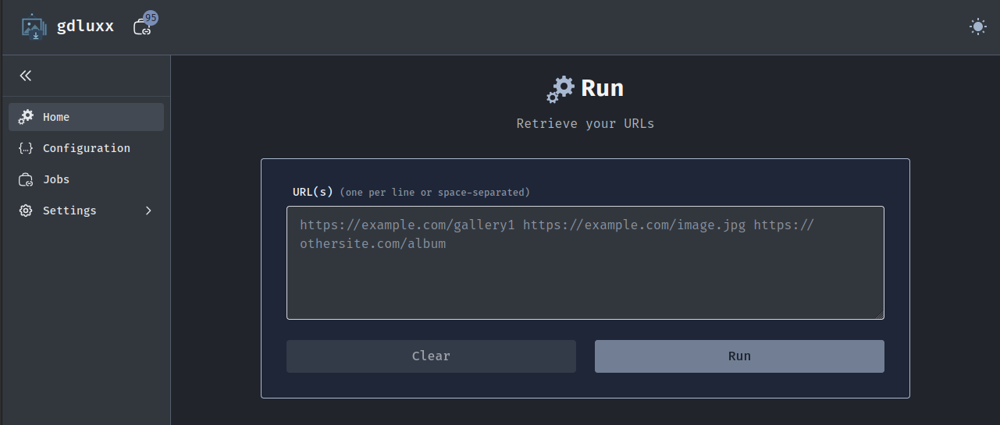
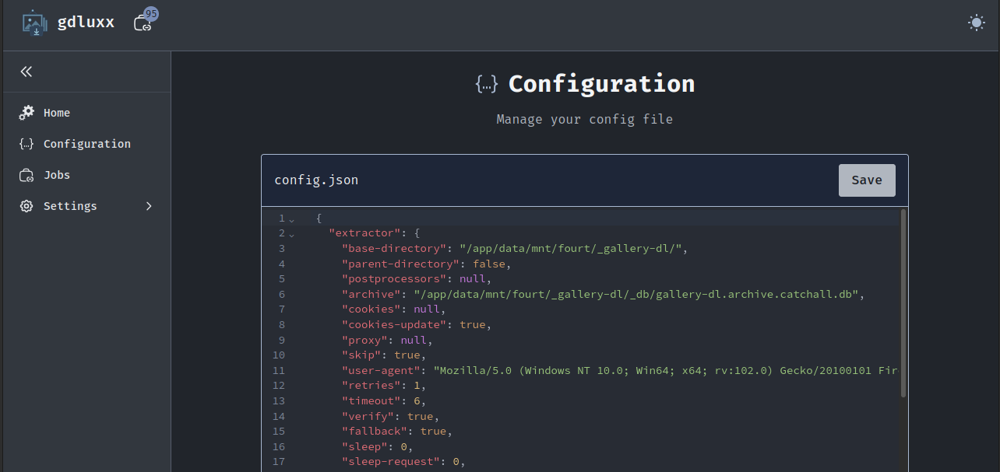
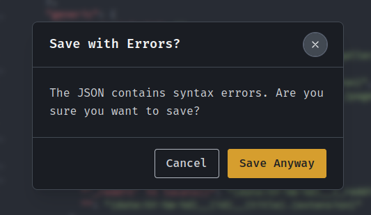
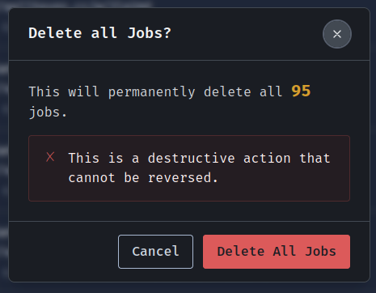
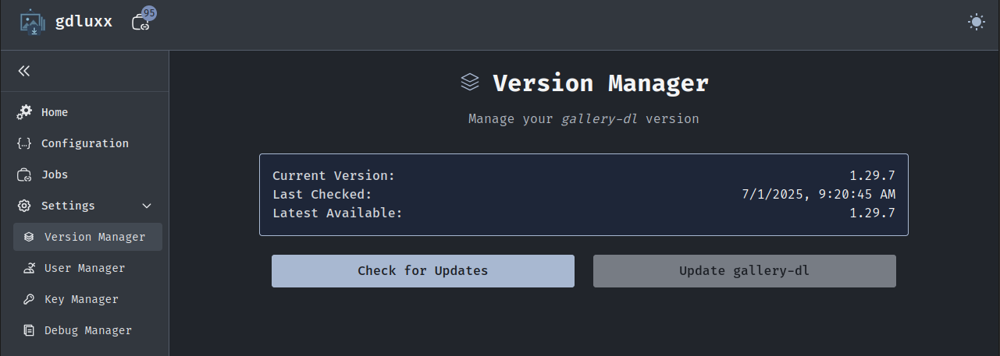
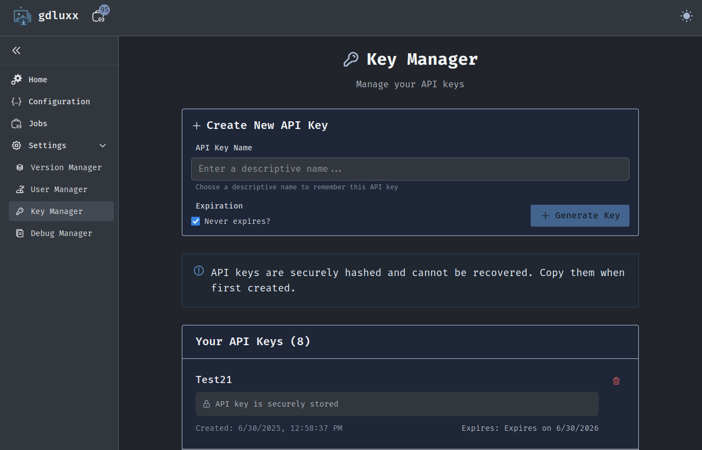

# gdluxx

gdluxx is nothing more than a self-hosted browser based gui for
[_gallery-dl_](https://github.com/mikf/gallery-dl)

[See some screenshots](#screenshots)

## What's it about?

- **GUI**: An interface for _gallery-dl_ to act upon one or more URLs
- **Configuration Editor**: Built-in JSON editor to create/modify your
  configuration file
  - Includes syntax highlighting and validation to ensure there are no errors
- **Browser Extension Support** An endpoint for receiving URLs from the
  companion browser extension
  - API key management for secure external access
- **Real-time Updates**: Job monitoring with live output streaming
- **Job Queue Management**: View running, completed, and failed downloads with
  output
- **Version Management**: Download and update _gallery-dl_ from the browser

## Installation

Only Docker installation is supported.

### Quick Start

1. ⚠️ Create the data directory first ⚠️

   ```bash
    mkdir data
   ```

2. Copy environment file

   `cp .env.example .env`

3. Generate your `AUTH_SECRET`

   `openssl rand -hex 32`

4. Paste your generated `AUTH_SECRET` into your `.env` file

5. Run `docker compose up -d`

   ```yaml
   name: gdluxx

   services:
     gdluxx:
       image: ghcr.io/gdluxx/gdluxx:latest
       container_name: gdluxx
       ports:
         - '7755:7755'
       volumes:
         - ./data:/app/data
       environment:
         - AUTH_SECRET=${AUTH_SECRET}
       restart: unless-stopped
       deploy:
         restart_policy:
           condition: on-failure
           max_attempts: 3
           delay: 3s
   ```

### ⚠️ **Critical: Directory Permissions** ⚠️

You MUST create the bind mount directory before starting the container. The
container runs as user 1000:1000, not root, and _cannot modify host directory
permissions_ for you.

If you skip step 1 above, Docker will create the directory as root and the
container will fail to start with permission errors.

### Custom paths: Want your data elsewhere?

Create the directory first:

`mkdir -p ~/Documents/gdluxx/data`

Then update your compose volumes to: `~/Documents/gdluxx/data:/app/data`

### Windows Users

For generating AUTH_SECRET on Windows, try
[CryptoTool's OpenSSL](https://www.cryptool.org/en/cto/openssl/) or install
OpenSSL via WSL/Git Bash.

### Why Not Docker Volumes?

Docker volumes hide your downloads inside Docker's storage. Bind mounts give you
direct file access for easy management.

If you're not familiar with Docker bind mounts, you can read about them
[here](https://docs.docker.com/get-started/workshop/06_bind_mounts/)

## Configuration

gdluxx will use the `data/` directory to store:

- `gdluxx.db` - For storing authentication credentials, jobs data, API keys, and
  _gallery-dl_ version info
- `config.json` - Your _gallery-dl_ configuration
- `gallery-dl.bin` - _gallery-dl_ binary file
- _gallery-dl_ downloads

## Screenshots

<p align="center">
   
   
   
   
   
 
</p>

## TODO

1. Auth

   - [x] Add authentication
     - [x] Add internal key authentication for internal endpoints
     - [x] Implement RESTful approach to deleting API keys (instead of POST)
     - [ ] Add OIDC support
     - [x] Migrate API key generation to _better-auth_

2. UX/UI

   - [x] Combine JobList and JobListModal components
   - [x] Fix ConfirmModal not picking up keyboard focus
   - [x] Add delete confirm modal for individual job deletion
   - [x] Fix spacing for <Info> modal in /config for "Loaded example"

3. Docs

   - [ ] Build documentation
   - [ ] Tie in _gallery-dl_ docs

4. Misc

   - [x] Consolidate SVG icons
   - [ ] Consider alternatives to deprecated `document.execCommand('copy')`
         (jobOutputModal)
   - [x] Combine `JobList` components
   - [x] ~~Adjust `api-keys.json` file permissions~~
   - [ ] Consolidate notification system
   - [x] Add CLI options
   - [ ] Prevent `Run` action when _gallery-dl_ isn't available

5. Features

   - [ ] Drag and drop for input files
   - [ ] Drag and drop for config files
   - [ ] Add `--extractor-info` and `--list-keywords` page
   - [x] Allow ConfigEditor component to update paths smartly
     - log paths - /app/data/logs
     - archive paths - /app/data/archives
   - [ ] Add success/failed count per job in JobsList

6. Considerations

   - [ ] Job queuing
   - [ ] Job scheduling

7. Incorporate _gallery-dl_ optional dependencies

   - [ ] yt-dlp or youtube-dl: HLS/DASH video downloads, ytdl integration
   - [ ] FFmpeg: Pixiv Ugoira conversion
   - [ ] mkvmerge: Accurate Ugoira frame timecodes
   - [ ] PySocks: SOCKS proxy support
   - [ ] brotli or brotlicffi: Brotli compression support
   - [ ] zstandard: Zstandard compression support
   - [ ] PyYAML: YAML configuration file support
   - [ ] toml: TOML configuration file support for Python<3.11
   - [ ] SecretStorage: GNOME keyring passwords for --cookies-from-browser
   - [ ] Psycopg: PostgreSQL archive support
   - [ ] truststore: Native system certificate stores

## API Usage

If you have interest in using the API endpoint outside the companion browser
extension, create an API key in the settings, then send POST requests to
`/api/extension/external`:

```json
{
  "urlToProcess": "https://example.com/image-gallery",
  "apiKey": "your-api-key-here"
}
```

## What's in a name?

gdluxx is pronounced `jee dee luks`

It's a combination of _gallery-dl_ and deluxe
