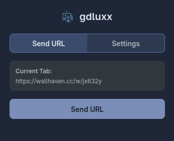
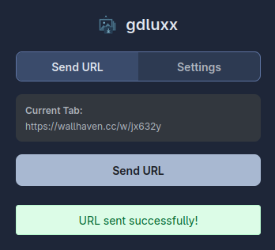
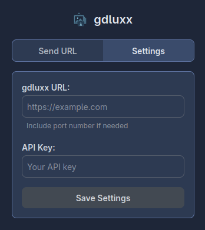

# gdluxx-browser

gdluxx-browser is a companion browser extension for
[gdluxx](https://github.com/gdluxx/gdluxx)

[See some screenshots](#screenshots)

## What's it about?

gdluxx exposes an API endpoint. This extension is simply a small popup that
allows you to enter the URL for gdluxx along with an API key (essentially a
password). You can then send the active tab URL to gdluxx with a button click.
gdluxx will execute [_gallery-dl_](https://github.com/mikf/gallery-dl) against
the received URL.

## Why?

I've been using _gallery-dl_ for a long time now, it's a great program. And
while I've come up with processes to make using _gallery-dl_ simpler (rather
than executing it against one URL at a time in the terminal), this will
eliminate the need to leave the browser. I'm guessing I'll be needing more
storage space very soon.

## Installation

The extension isn't available on browser stores yet. You'll need to install it
manually:

### Chrome (and Chromium based variants)

1. Download the latest `gdluxx-browser-chrome.zip` from the
   [releases page](https://github.com/gdluxx/gdluxx-browser/releases)
2. Extract the zip file to a folder on your computer
3. Open Chrome and go to `chrome://extensions/`
4. Enable "Developer mode" (toggle in the top right)
5. Click "Load unpacked" and select the extracted folder
6. The extension should now appear in your browser toolbar

### Firefox (and variants)

1. Download the latest `gdluxx-browser-firefox.zip` from the
   [releases page](https://github.com/gdluxx/gdluxx-browser/releases)
2. Open Firefox and go to `about:debugging`
3. Click "This Firefox" in the left sidebar
4. Click "Load Temporary Add-on"
5. Select the downloaded zip file (don't extract it)
6. The extension will be loaded temporarily until you restart Firefox

Note: For permanent installation in Firefox, you'll need to
[sign the extension](https://support.mozilla.org/en-US/kb/add-on-signing-in-firefox)
or use Firefox Developer Edition.

## How to Use

1. Make sure you have gdluxx running and accessible
2. Click the extension icon in your browser toolbar
3. In the popup, enter:
   - Your gdluxx server URL (e.g., `https://your-server.com` or
     `http://localhost:8080`)
   - Your API key from gdluxx
4. Click "Save Settings"
5. Navigate to any webpage you want to download with _gallery-dl_
6. Click the extension icon and hit "Send URL"
7. gdluxx will receive the URL and start downloading

The extension remembers your settings, so you only need to configure it once.

## Requirements

- A running instance of [gdluxx](https://github.com/gdluxx/gdluxx)
- An API key configured in gdluxx
- Chrome/Chromium 88+ or Firefox 78+

## Alternative: Using curl

If you prefer the command line, want to test the gdluxx API directly, or use it
programmatically you can send URLs manually:

```bash
curl -X POST https://your-gdluxx-server.com/api/extension/external \
  -H "Content-Type: application/json" \
  -H "Authorization: Bearer your-api-key-here" \
  -d '{"urlToProcess": "https://example.com/some-gallery"}'
```

Replace `your-gdluxx-server.com` with your actual gdluxx server URL and
`your-api-key-here` with your API key.

## Screenshots

<p align="center">
   
   
 
</p>

## Troubleshooting

**Extension doesn't appear after installation**

- Make sure you enabled "Developer mode" in Chrome
- Try refreshing the extensions page
- Check that the zip file extracted properly

**"Please save your settings first" message**

- Enter both your gdluxx URL and API key in the settings
- Make sure there are no extra spaces in your entries

**Network errors when sending URLs**

- Verify your gdluxx server is running and accessible
- Check that your API key is correct
- Ensure your gdluxx URL doesn't have a trailing slash

**Firefox extension disappears after restart**

- This is expected behavior for temporarily loaded extensions
- You'll need to reload it each time you restart Firefox

---

1. Features

- [ ] Send multiple tabs
- [ ] Add check `is URL supported?`
- [ ] Add context menu for individual images

---

## Developers

### Building from Source

Requirements:

- Node.js 18+
- pnpm

```bash
# Clone the repository
git clone https://github.com/gdluxx/gdluxx-browser.git
cd gdluxx-browser

# Install dependencies
pnpm install

# packaage.json scripts
# development
pnpm dev:chrome
pnpm dev:firefox

# Build for production
pnpm build:chrome
pnpm build:firefox

# Create zip files
pnpm zip:chrome
pnpm zip:firefox
```

### Architecture

Built with [WXT](https://github.com/wxt-dev/wxt) The extension uses:

- **Background Script** Handles API communication with gdluxx
- **Popup Interface** Simple UI for settings and URL sending
- **Browser Storage** Persists API URL and key settings
- **Minimal Permissions** Only requires `activeTab` and `storage`

### code Quality

```bash
pnpm typecheck
pnpm lint
pnpm format
pnpm fix-all
```
