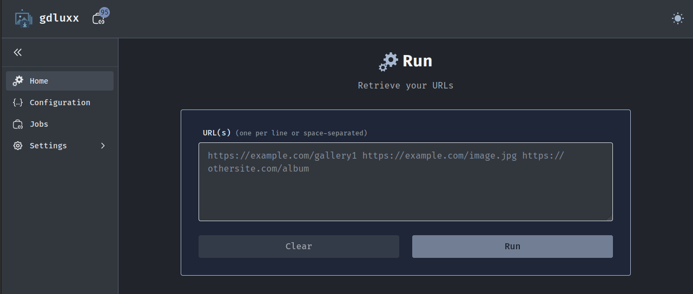
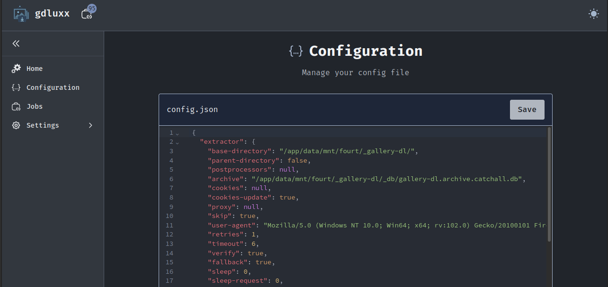
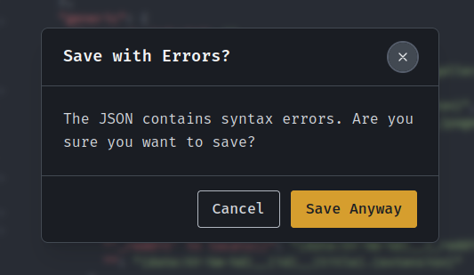
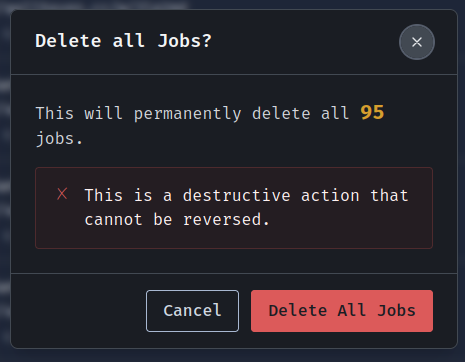
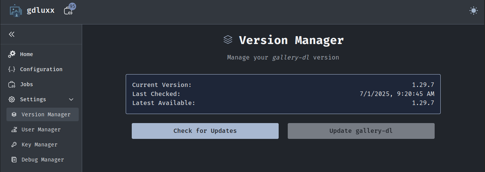
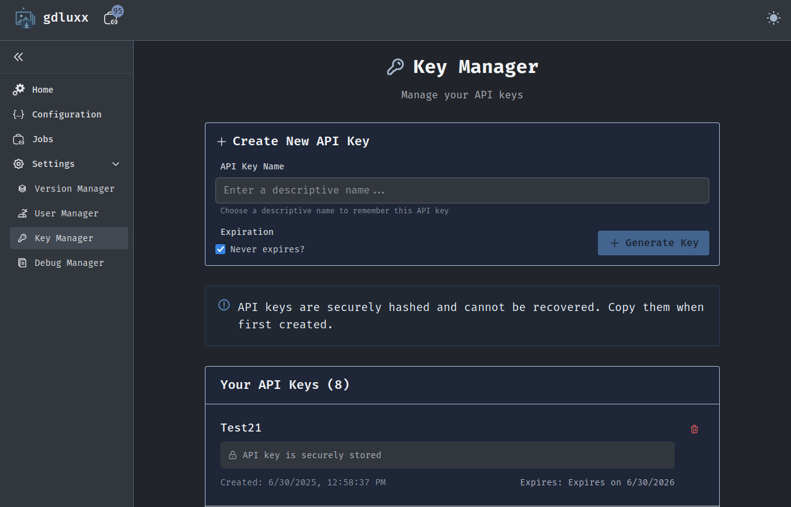
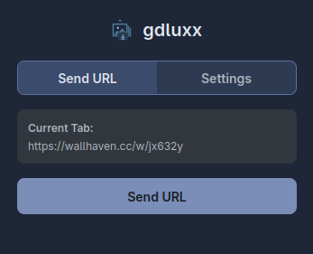
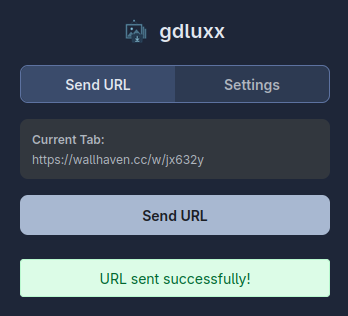
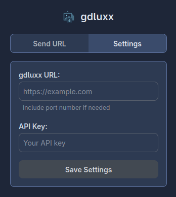

# gdluxx

gdluxx is nothing more than a self-hosted browser based gui for
[_gallery-dl_](https://github.com/mikf/gallery-dl)

[See some screenshots](#screenshots)

## What's it about?

- **GUI**: An interface for _gallery-dl_ to act upon one or more URLs
- **Configuration Editor**: Built-in JSON editor to create/modify your
  configuration file
  - Includes syntax highlighting and validation to ensure there are no errors
- **Browser Extension Support** An endpoint for receiving URLs from the
  companion browser extension
  - API key management for secure external access
- **Real-time Updates**: Job monitoring with live output streaming
- **Job Queue Management**: View running, completed, and failed downloads with
  output
- **Version Management**: Download and update _gallery-dl_ from the browser

## Browser Extension

gdluxx exposes an API endpoint. You can then send the active tab URL to gdluxx
with a button click. You can also right-click a single image to be sent. gdluxx
will execute _gallery-dl_ against the received URL or image link. Now you don't
have to leave your browser to use _gallery-dl_!

## Why?

I've been using _gallery-dl_ for a long time now, it's a great program. And
while I've come up with processes to make using _gallery-dl_ simpler (rather
than executing it against one URL at a time in the terminal), this will
eliminate the need to leave the browser. I'm guessing I'll be needing more
storage space very soon.

---

## Installation

Only Docker installation is supported.

### App Quick Start

1. ⚠️ Create the data directory first ⚠️

   ```bash
    mkdir data
   ```

2. Copy environment file

   `cp .env.example .env`

3. Generate your `AUTH_SECRET`

   `openssl rand -hex 32`

4. Paste your generated `AUTH_SECRET` into your `.env` file

5. Run `docker compose up -d`

   ```yaml
   name: gdluxx

   services:
     gdluxx:
       image: ghcr.io/gdluxx/gdluxx:latest
       container_name: gdluxx
       ports:
         - '7755:7755'
       volumes:
         - ./data:/app/data
       environment:
         - AUTH_SECRET=${AUTH_SECRET}
       restart: unless-stopped
       deploy:
         restart_policy:
           condition: on-failure
           max_attempts: 3
           delay: 3s
   ```

### ⚠️ **Critical: Directory Permissions** ⚠️

You MUST create the bind mount directory before starting the container. The
container runs as user 1000:1000, not root, and _cannot modify host directory
permissions_ for you.

If you skip step 1 above, Docker will create the directory as root and the
container will fail to start with permission errors.

### Custom paths: Want your data elsewhere?

Create the directory first:

`mkdir -p ~/Documents/gdluxx/data`

Then update your compose volumes to: `~/Documents/gdluxx/data:/app/data`

### Windows Users

For generating AUTH_SECRET on Windows, try
[CryptoTool's OpenSSL](https://www.cryptool.org/en/cto/openssl/) or install
OpenSSL via WSL/Git Bash.

### Why Not Docker Volumes?

Docker volumes hide your downloads inside Docker's storage. Bind mounts give you
direct file access for easy management.

If you're not familiar with Docker bind mounts, you can read about them
[here](https://docs.docker.com/get-started/workshop/06_bind_mounts/)

## Configuration

gdluxx will use the `data/` directory to store:

- `gdluxx.db` - For storing authentication credentials, jobs data, API keys, and
  _gallery-dl_ version info
- `config.json` - Your _gallery-dl_ configuration
- `gallery-dl.bin` - _gallery-dl_ binary file
- _gallery-dl_ downloads

---

## Extension Install

The extension isn't available on browser stores yet. You'll need to install it
manually:

### Chrome (and Chromium based variants)

[Chrome Web Store](https://chromewebstore.google.com/detail/gdluxx-extension/cbhdooiekcodjfckmgemblgikbdipgmc)

Or:

1. Download the latest `gdluxx-browser-chrome.zip` from the
   [releases page](https://github.com/gdluxx/gdluxx-browser/releases)
2. Extract the zip file to a folder on your computer
3. Open Chrome and go to `chrome://extensions/`
4. Enable "Developer mode" (toggle in the top right)
5. Click "Load unpacked" and select the extracted folder
6. The extension should now appear in your browser toolbar

### Firefox (and variants)

[Firefox Add-Ons](https://addons.mozilla.org/en-US/firefox/addon/gdluxx-extension/)

Or:

1. Download the latest `gdluxx-browser-firefox.zip` from the
   [releases page](https://github.com/gdluxx/gdluxx-browser/releases)
2. Open Firefox and go to `about:debugging`
3. Click "This Firefox" in the left sidebar
4. Click "Load Temporary Add-on"
5. Select the downloaded zip file (don't extract it)
6. The extension will be loaded temporarily until you restart Firefox

Note: For permanent installation in Firefox, you'll need to
[sign the extension](https://support.mozilla.org/en-US/kb/add-on-signing-in-firefox)
or use Firefox Developer Edition.

## How to Use the extension?

1. Make sure you have gdluxx running and accessible
2. Click the extension icon in your browser toolbar
3. In the popup, enter:
   - Your gdluxx server URL (e.g., `https://your-server.com` or
     `http://localhost:8080`)
   - Your API key from gdluxx
4. Click "Save Settings"
5. Navigate to any webpage you want to download with _gallery-dl_
6. Click the extension icon and hit "Send URL"
7. gdluxx will receive the URL and start downloading

The extension remembers your settings, so you only need to configure it once.

## Requirements

- A running instance of [gdluxx](https://github.com/gdluxx/gdluxx)
- An API key configured in gdluxx
- Chrome/Chromium 88+ or Firefox 78+

## Screenshots

## App

<p align="center">
   
   
   
   
   
 
</p>

## Extension

<p align="center">
   
   
 
</p>

## TODO

1. Auth

   - [x] Add authentication
     - [x] Add internal key authentication for internal endpoints
     - [x] Implement RESTful approach to deleting API keys (instead of POST)
     - [ ] Add OIDC support
     - [x] Migrate API key generation to _better-auth_

2. UX/UI

   - [x] Combine JobList and JobListModal components
   - [x] Fix ConfirmModal not picking up keyboard focus
   - [x] Add delete confirm modal for individual job deletion
   - [x] Fix spacing for <Info> modal in /config for "Loaded example"

3. Docs

   - [x] Build documentation
   - [ ] Tie in _gallery-dl_ docs

4. Misc

   - [x] Consolidate SVG icons
   - [ ] Consider alternatives to deprecated `document.execCommand('copy')`
         (jobOutputModal)
   - [x] Combine `JobList` components
   - [x] ~~Adjust `api-keys.json` file permissions~~
   - [ ] Consolidate notification system
   - [x] Add CLI options
   - [ ] Prevent `Run` action when _gallery-dl_ isn't available

5. Features

   - [ ] ~~Drag and drop for input files~~
   - [x] Drag and drop for config files
   - [x] Add `--extractor-info` and `--list-keywords` page
   - [x] Allow ConfigEditor component to update paths smartly
     - log paths - /app/data/logs
     - archive paths - /app/data/archives
   - [x] Add success/failed count per job in JobsList

6. Extension

   - [ ] Send multiple tabs
   - [ ] Add check `is URL supported?`
   - [ ] Add context menu for individual images

7. Considerations

   - [ ] Job queuing
   - [ ] Job scheduling

8. Incorporate _gallery-dl_ optional dependencies

   - [ ] yt-dlp or youtube-dl: HLS/DASH video downloads, ytdl integration

## API Usage

If you have interest in using the API endpoint outside the companion browser
extension, create an API key in the settings, then send POST requests to
`/api/extension/external`:

```bash
curl -X POST \
  -H "Authorization: Bearer your-api-key-here" \
  -H "Content-Type: application/json" \
  -d '{"urlToProcess": "https://example.com/image-gallery"}' \
  https://your-gdluxx-url/api/extension/external
```

## What's in a name?

gdluxx is pronounced `jee dee luks`

It's a combination of _gallery-dl_ and deluxe
