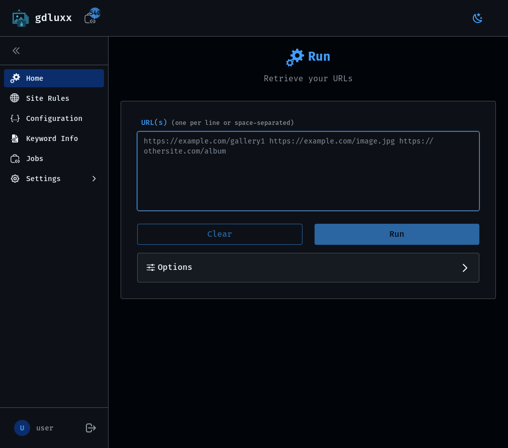
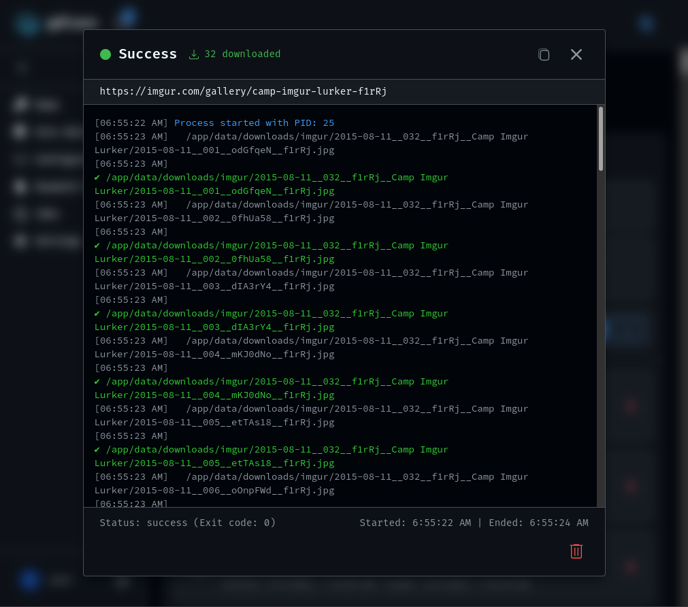

# gdluxx

gdluxx is nothing more than a self-hosted browser based gui for
[_gallery-dl_](https://github.com/mikf/gallery-dl)

| Main Interface                                               | Job Output                                                     |
|:-------------------------------------------------------------|:---------------------------------------------------------------|
|  |  |

[See some screenshots](https://gdluxx.app/screenshots)

## What's it about?

- **GUI**: Paste one or more URLs and download. No command line required
- **Batch Processing**: Submit multiple URLs at once
- **Site Rules**: Apply specific gallery-dl options based on URL patterns
- **Config Editor**: Built-in JSON editor with syntax highlighting, validation,
  and file upload
- **Keyword Info**: Test what metadata different sites provide for use in your
  config file
- **Job Management**: View running, completed, and failed jobs with output and
  statistics
- **Browser Extension**: Send URLs directly from your browser with a click
- **API**: Programmatically send URLs via API endpoint from your own scripts
- **Version Management**: Download and update _gallery-dl_ binary without
  leaving the app

## Browser Extension

The browser extension allows sending URLs directly to gdluxx without leaving
your browser

- **Click to send**: URL sending from your toolbar
- **Keyboard shortcut**: Alt+L (customizable) opens the UI
- **Image context menu**: Right-click any image to send it directly
- **Batch sending**: Send multiple URLs at once
- **URL substitution**: Match and replace parts of URLs
- **Permissions Control**: Limit the extension to specific sites you choose or
  all of them

## Why?

I've been using _gallery-dl_ for a long time now, it's a great program. And
while I've come up with processes to make using _gallery-dl_ simpler (rather
than executing it against one URL at a time in the terminal), this will
eliminate the need to leave the browser. I'm guessing I'll be needing more
storage space very soon.

## Docs

- [Main](https://gdluxx.app)
- [gdluxx install](https://gdluxx.app/getting-started/installation)
- [extension install](https://gdluxx.app/extension/index)

## Quick Start Install

Only Docker installation is supported.

> [!WARNING]  
> To avoid permissions issue, the bind mount directory must not be created by
> the container.

1. ```shell
    git clone https://github.com/gdluxx/gdluxx.git
    ```
2. ```shell
    cd gdluxx
    ```
3. ```shell
    mkdir data
    ```
4. ```shell
    cp .env.example .env
    ```
5. ```shell
    openssl rand -hex 32 | xargs -I{} sed -i'' "s/^AUTH_SECRET=.*/AUTH_SECRET={}/" .env
    ```
   - This will generate an AUTH_SECRET token and update the `.env` file with it
6. ```shell
    docker compose up -d
    ```
7. Navigate to [http://localhost:7755](http://localhost:7755) in your browser

> [!TIP]  
> See [install guide](https://gdluxx.app/getting-started/installation) for
> details on ORIGIN configuration and custom paths

## Extension Install

The extension is available on both the Chrome Web Store and Firefox Add-ons.

- [Chrome](https://chromewebstore.google.com/detail/gdluxx-extension/cbhdooiekcodjfckmgemblgikbdipgmc)
- [Firefox](https://addons.mozilla.org/en-US/firefox/addon/gdluxx-extension/)

## What's in a name?

gdluxx is pronounced `jee dee luks`

It's a combination of _gallery-dl_ and deluxe
