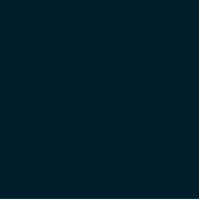

# Zero to First Download

A first-time walkthrough of gdluxx, from initial setup to watching your first
download complete.

## 1. Open the Web UI

Navigate to your gdluxx server's address in a browser. On a fresh install
there's no account yet, so you're redirected straight to the setup page.

{.screenshot}

## 2. Create the Admin Account

Fill in the setup form with an email and password, then click Create Account.
This is a single-user system with no multi-user support, so this becomes your
only account.

{.screenshot}

## 3. Paste a URL on the Run Page

On the Run page, paste one or more URLs into the URL(s) to process field —
separate multiple entries with a new line or a space. You can optionally add
gallery-dl command-line options for this run, but it's not required for a first
download.

{.screenshot}

## 4. Start the Job

Click Run to start the job. A modal pops up immediately showing the first job's
live output, and each URL you submitted becomes its own separate job.

{.screenshot}

## 5. Watch the Jobs List

The Jobs page lists every job you've started, showing which are still running
and which have finished. This is where you can track a download's progress after
closing the output modal.

{.screenshot}

## 6. View the Completed Download

Click a completed job to see its full output, including how many files were
downloaded successfully versus skipped or errored. A job showing successes with
zero failures is a clean run — your first download is done.

{.screenshot}

