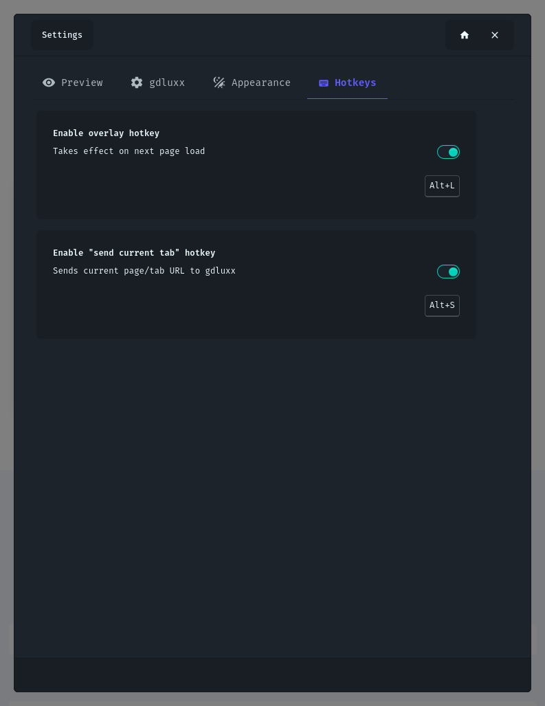

# Browser Extension Tour

A step-by-step look at the gdluxx browser extension's core screens — screenshots
are click to enlarge.

## 1. Main Overlay

Opening the overlay (via the toolbar popup, your configured hotkey, or the
right-click menu) extracts every image and link on the current page into
separate Images and URLs tabs, each showing a live count. From there you can
filter by keyword, select items individually or in bulk, and spot duplicate or
substitution-modified items via badges.

{.screenshot}

## 2. Advanced Filtering

The Extraction panel controls exactly what gets pulled from the page: Range mode
restricts extraction to content between two CSS selectors, while Targeted mode
pulls images only, scoped by a CSS selector or string markers.

{.screenshot}

## 3. String Substitution

URL Substitution Rules rewrite selected URLs with regex patterns before you
send, copy, or download them, with capture-group support, per-rule
global/ignore-case flags, and a live before/after preview.

{.screenshot}

## 4. Preview

The Preview settings control inline thumbnails for items in the Images tab and
an optional hover preview that shows a larger floating image when you hover a
row.

{.screenshot}

## 5. gdluxx Connection

The gdluxx Connection tab is where you enter your server URL and API key,
required before you can send URLs, sync extraction profiles, or use remote
profile backups, with a Test Connection button to verify them before saving.

{.screenshot}

## 6. Appearance

Appearance settings switch the overlay between a modal or fullscreen display
mode and let you pick from the extension's own set of DaisyUI themes,
independent of the gdluxx web app's theme.

{.screenshot}

## 7. Hotkeys

The Hotkeys tab configures the overlay toggle shortcut (Alt+L by default) and a
separate, independently configurable hotkey for sending the current tab directly
without opening the overlay.

{.screenshot}

