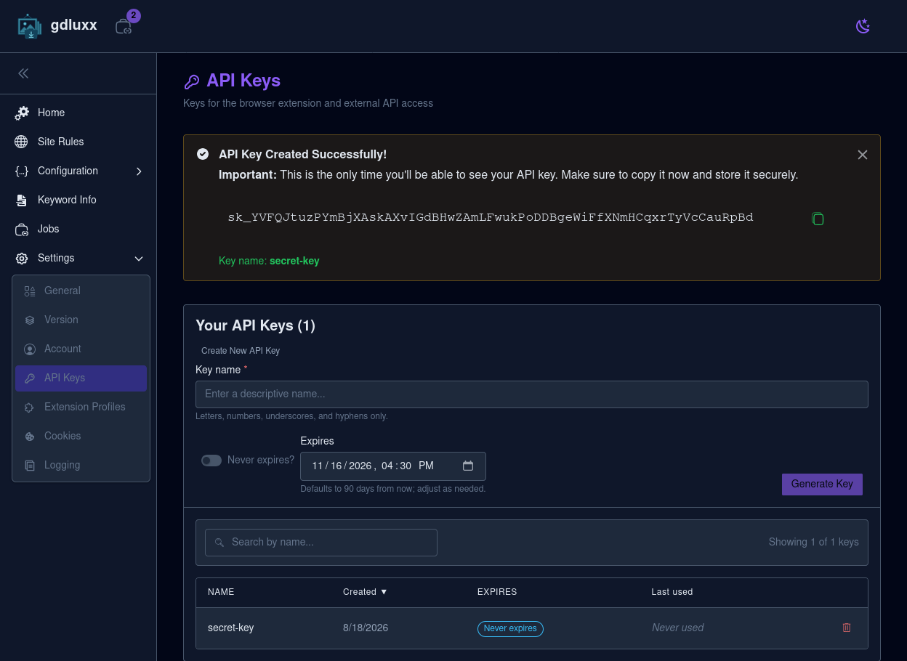
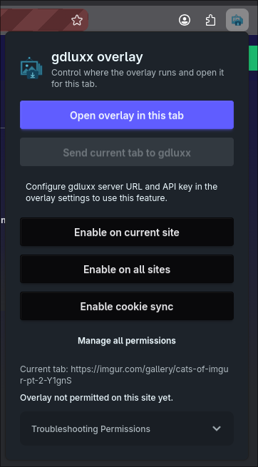
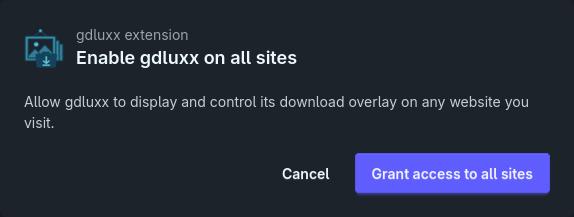
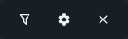
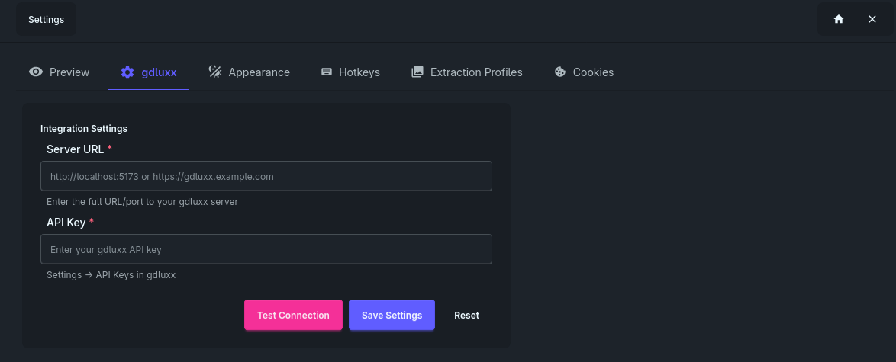
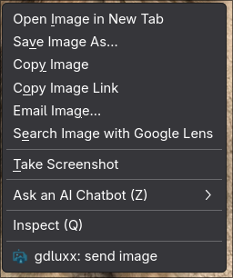
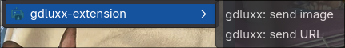
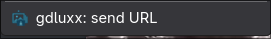
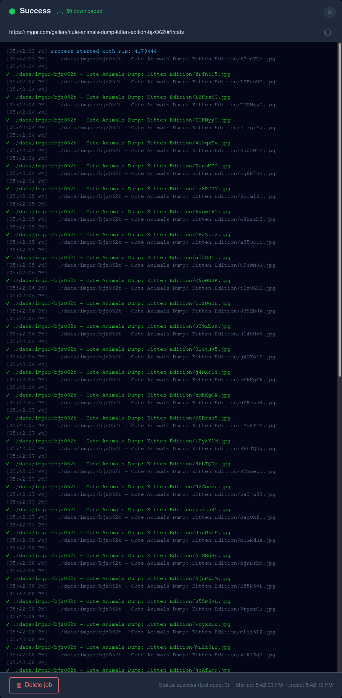

# Connect the Browser Extension

A walkthrough of connecting the browser extension to gdluxx, sending images or
links from a page, and confirming that the download completed successfully.

## 1. Generate an API Key

In gdluxx, open **Settings > API Keys**, enter a descriptive key name, choose an
expiration, and select **Generate Key**. Copy the new API key immediately and
store it securely because gdluxx shows it only once.

{.screenshot}

## 2. Enable the Extension on All Sites

Select the gdluxx extension in your browser toolbar. To make its overlay and
context-menu actions available on any supported page, select **Enable on all
sites**.

{.screenshot}

## 3. Grant Site Access

The extension opens a confirmation page for the broader permission. Select
**Grant access to all sites** to continue.

{.screenshot}

## 4. Open the Overlay Settings

Open the extension overlay, then select the gear icon in its header to open the
settings screen.

{.screenshot}

## 5. Configure the gdluxx Connection

Select the **gdluxx** settings tab. Enter the full URL of your gdluxx server and
paste the API key you generated earlier.

{.screenshot}

## 6. Test and Save the Connection

Select **Test Connection**. After the extension reports **Connection
successful!**, select **Save Settings** to keep the server URL and API key.

{.screenshot}

## 7. Send an Image

Right-click an image on a page and select **gdluxx: send image**. The extension
sends the image URL directly to gdluxx as a new job.

{.screenshot}

## 8. Choose What to Send from a Linked Image

When an image is also a link, the **gdluxx-extension** submenu lets you choose
between **gdluxx: send image** and **gdluxx: send URL**. Select the image to
download the displayed image itself, or select the URL to process the link's
destination.

{.screenshot}

## 9. Send a Link

Right-click a regular link and select **gdluxx: send URL** to submit its
destination to gdluxx.

{.screenshot}

## 10. Confirm the Download Completed

Open the submitted job in gdluxx to watch its output or review it after the
download finishes. A green **Success** status and an exit code of `0` confirm
that the job completed successfully.

{.screenshot}

