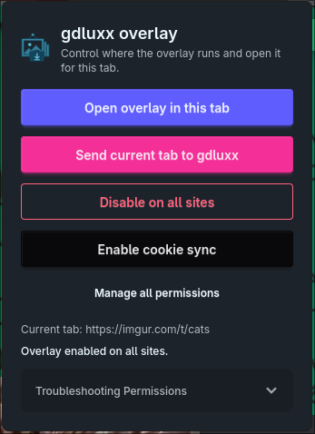
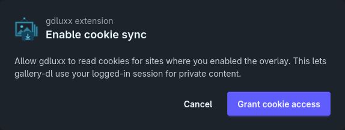
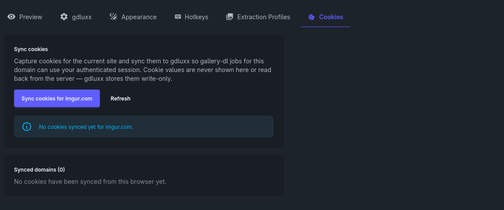
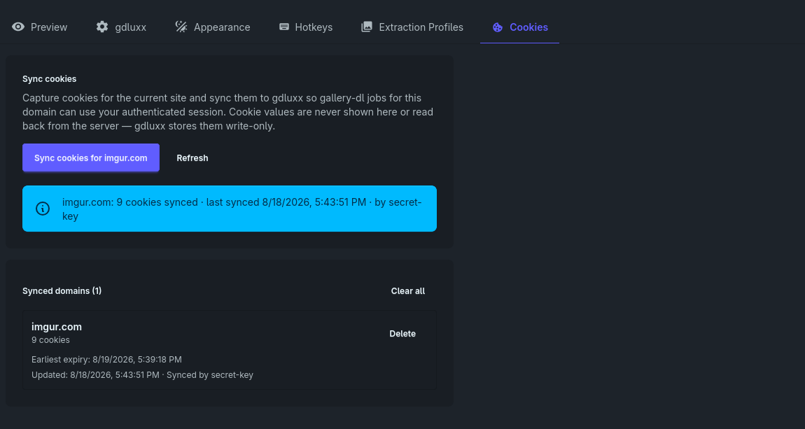

# Enable Cookie Sync

A walkthrough of granting the browser extension access to cookies and syncing an
authenticated session to gdluxx for sites that require you to be signed in.

Before starting, connect the extension to gdluxx, enable the overlay on the
target site, and sign in to that site in your browser.

## 1. Enable Cookie Sync

Open the gdluxx extension from your browser toolbar and select **Enable cookie
sync**. This permission is separate from the site access used by the overlay.

{.screenshot}

## 2. Grant Cookie Access

The extension opens a confirmation page explaining that cookie access lets
gallery-dl use your signed-in session for sites where the overlay is enabled.
Select **Grant cookie access** to continue.

{.screenshot}

## 3. Open the Cookies Settings

Open the extension overlay, select the gear icon, and then open the **Cookies**
tab. The page shows whether cookies have already been synced for the current
domain.

{.screenshot}

## 4. Sync the Current Site's Cookies

Select **Sync cookies for _domain_** to capture the current site's cookies and
send them to gdluxx. The synced result shows the domain, cookie count, and last
sync time. Future gallery-dl jobs for that domain can then use your
authenticated session.

Cookie values are never displayed in the extension or read back from the server.
You can delete one synced domain or select **Clear all** to remove every synced
domain.

{.screenshot}

