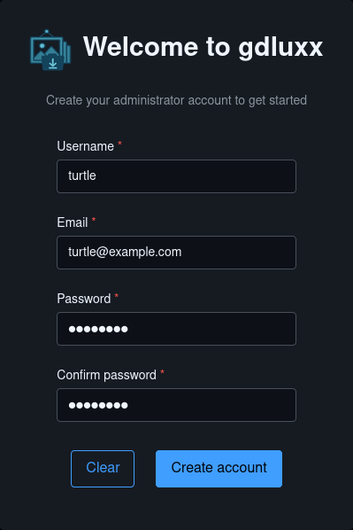
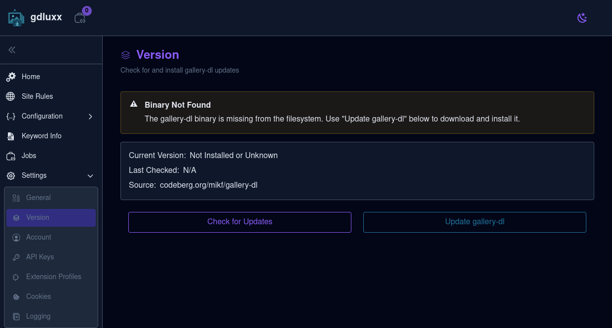
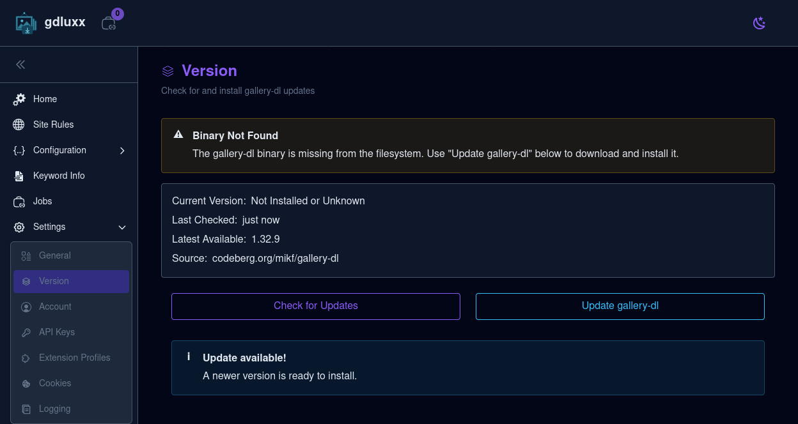
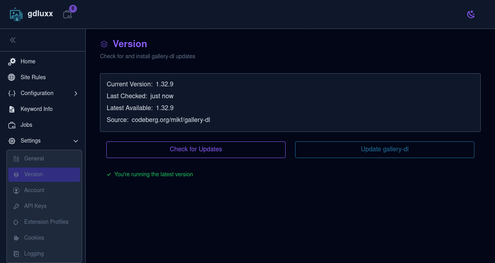
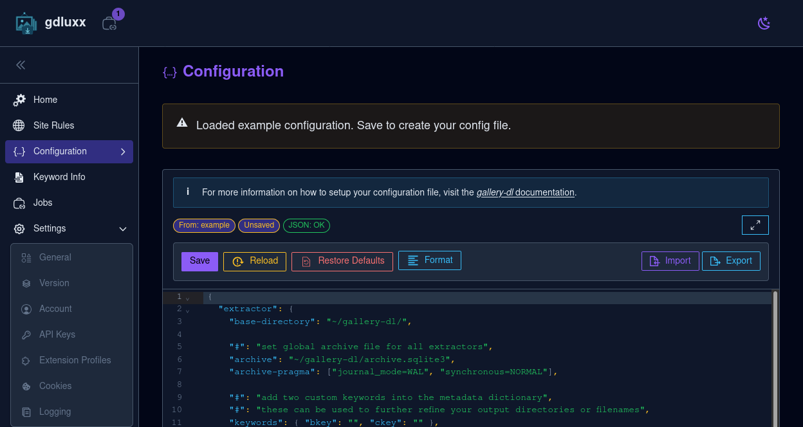
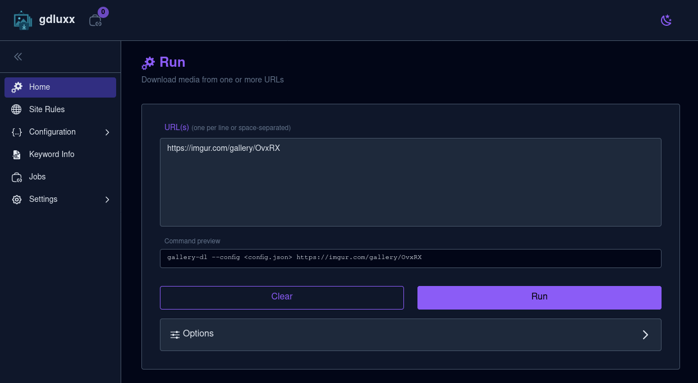
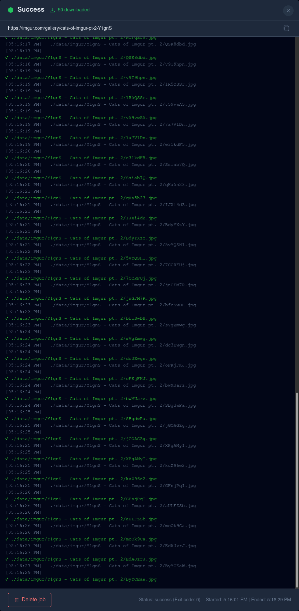

# Your First Download

A first-time walkthrough of gdluxx, from creating the administrator account to
confirming that your first download completed successfully.

## 1. Create the Administrator Account

Open your gdluxx server in a browser. On a fresh installation, fill in the
username, email, and password fields, then select **Create account**.

{.screenshot}

## 2. Open the Version Page

Before starting a download, open **Settings > Version**. A fresh installation
won't yet have the gallery-dl binary. It will be reported as missing and that
its version is unknown.

{.screenshot}

## 3. Check for Updates

Click **Check for Updates** to find the latest available gallery-dl version.
When gallery-dl is not installed, the page offers that version as an available
update.

{.screenshot}

## 4. Install gallery-dl

Select **Update gallery-dl** to download and install the available version. When
the installation finishes, the current and latest version numbers match and a
success message confirms that gallery-dl is up to date.

{.screenshot}

## 5. Save the Example Configuration

Open **Configuration** from the sidebar. On a fresh installation, gdluxx loads
an example gallery-dl configuration. Review it, adjust any settings you want,
then select **Save** to create your configuration file.

{.screenshot}

## 6. Start a Download

Return to **Home**, paste a supported URL into the **URL(s)** field, and review
the command preview. Select **Run** to start the download. You can enter
multiple URLs on separate lines or separated by spaces.

{.screenshot}

## 7. Confirm the Download Completed

The job output opens as the download runs and lists each downloaded file. A
green **Success** status and an exit code of `0` confirm that the job completed
successfully. You can reopen this output later from the **Jobs** page.

{.screenshot}

