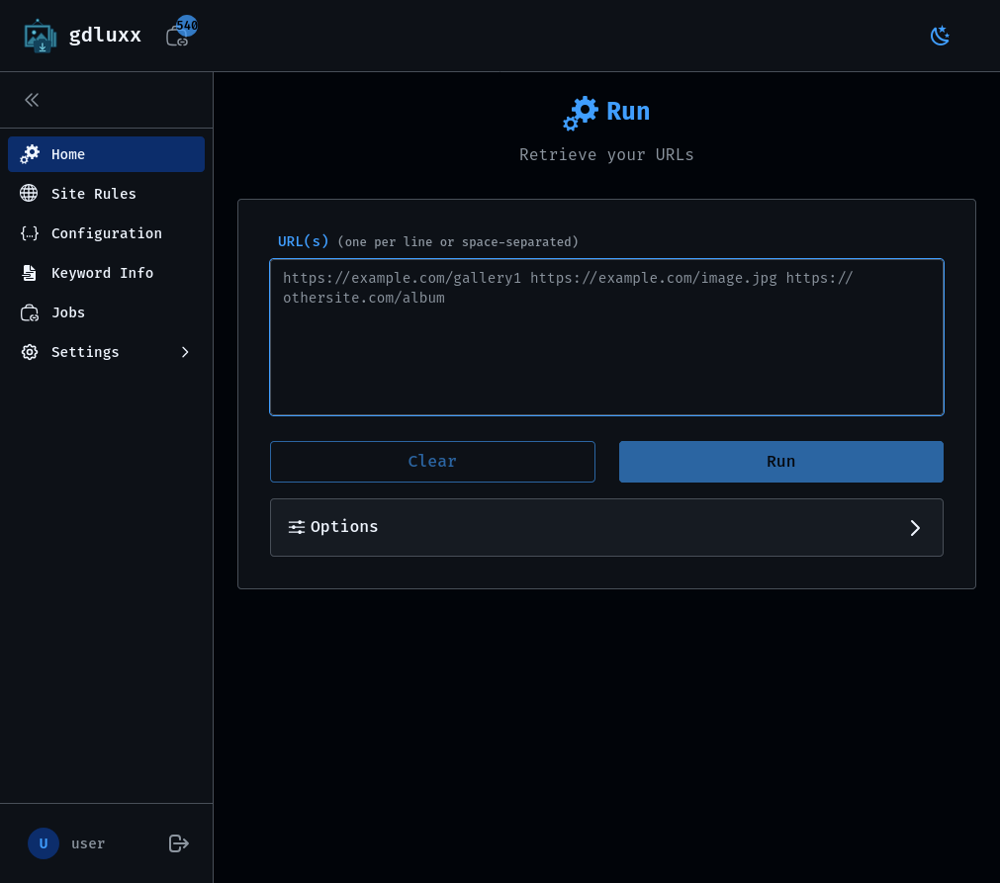
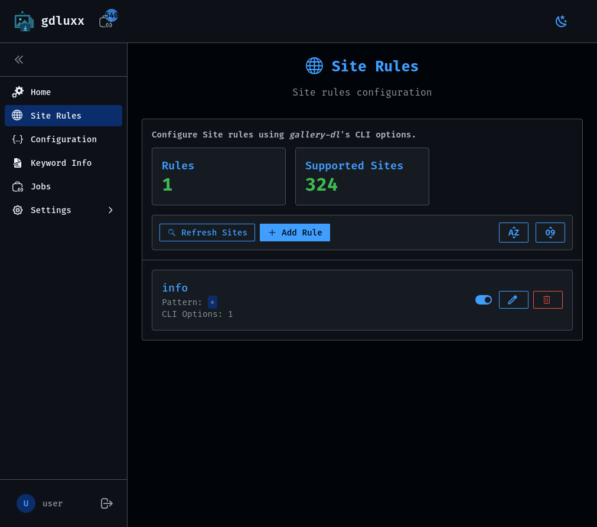
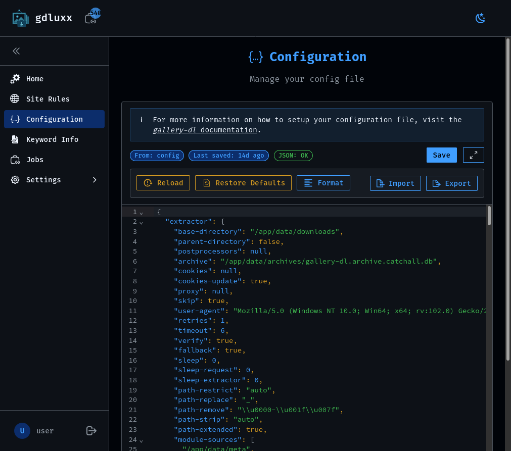
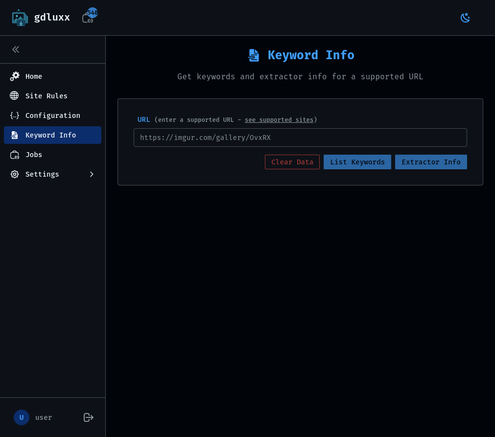
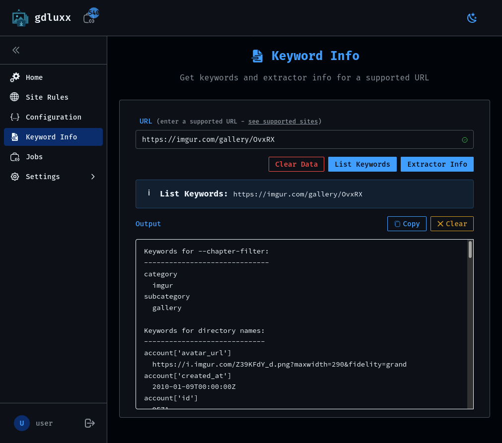
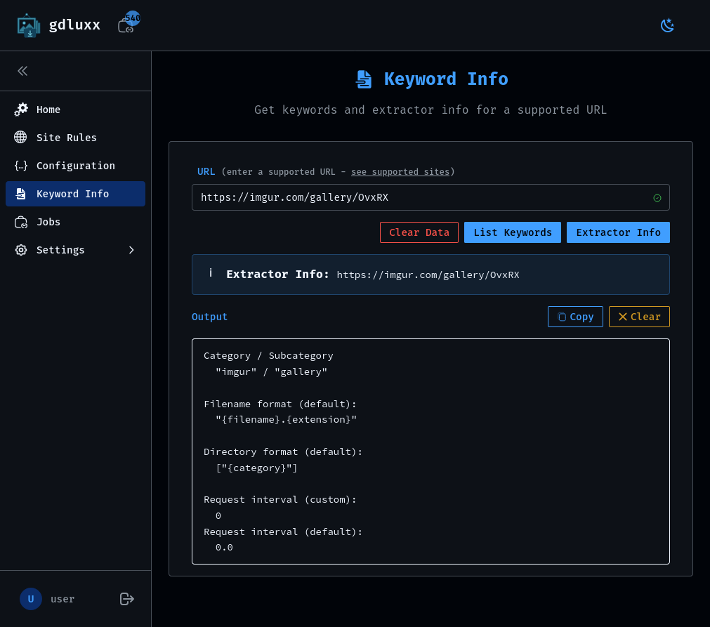
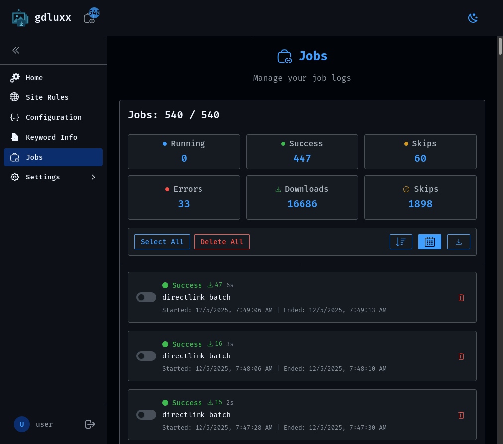
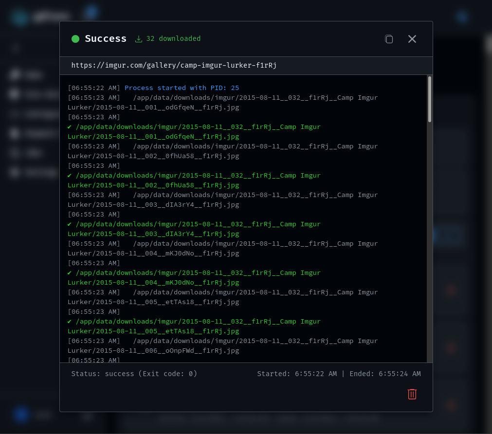

# Web App Tour

A step-by-step look at gdluxx's core pages — screenshots are click to enlarge.

## 1. Home / Run Page

The Run page is where you paste one or more URLs, pick any options for the
download, and start gallery-dl running against them. It's the page you'll land
on most often.

{.screenshot}

## 2. Site Rules

Site Rules let you define per-site option presets that are automatically applied
whenever a URL matches a configured pattern, so you don't have to re-enter the
same options for a site every time.

{.screenshot}

## 3. Config Editor

The Config Editor lets you view and edit gallery-dl's underlying JSON
configuration directly in the browser, for options not covered by Site Rules or
when you want finer control.

{.screenshot}

## 4. Keyword Info

Keyword Info inspects a URL and shows the gallery-dl keywords and extractor
metadata available for it — useful when building filename or filter expressions
that reference those keywords.

{.screenshot}

  
  

## 5. Jobs List

The Jobs List shows past and currently running jobs along with their status,
giving you an overview of what's finished, what's still in progress, and what
may have failed.

{.screenshot}

## 6. Job Output

Selecting a job opens its live console output, so you can watch a running
download's progress or review the log from a completed one.

{.screenshot}

